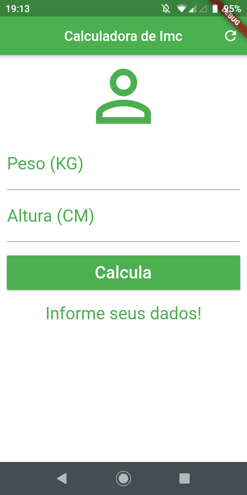
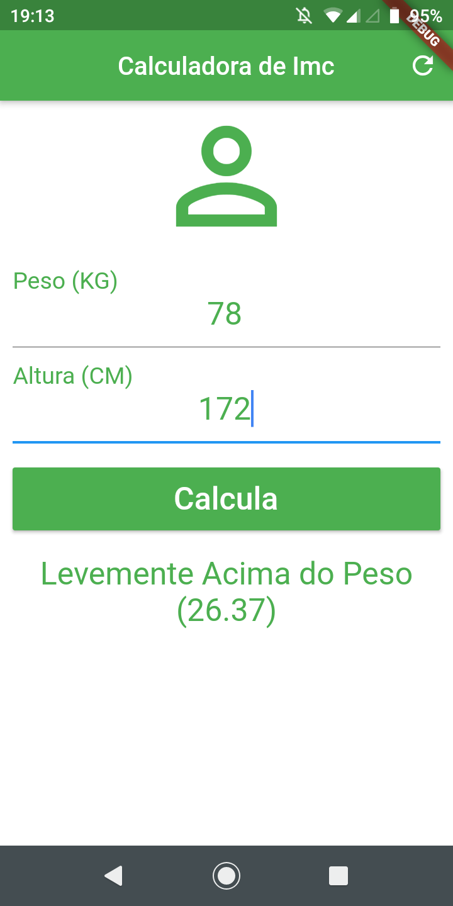

# calculadora_imc

Este foi feito em Flutter.

## Sobre

Este app faz o calculo do imc de uma pessoa.

## Documentação online do Flutter
For help getting started with Flutter, view our
[online documentation](https://flutter.dev/docs), which offers tutorials,
samples, guidance on mobile development, and a full API reference.
